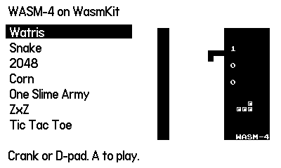
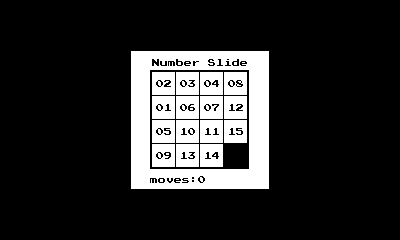

# WASM-4 on a Playdate powered by WasmKit

A [WASM-4](https://wasm4.org) fantasy console for the [Panic Playdate](https://play.date) powered by [WasmKit](https://github.com/swiftwasm/WasmKit).




## Build

- **Playdate SDK** from [play.date/dev](https://play.date/dev), at `~/Playdate`.
  Tested with 3.1.2. Its installer also places an ARM compiler in `/usr/local/playdate`.
- **Swift 6.4** from [swift.org](https://swift.org/install). Xcode's bundled toolchain will *not* work.

```
git clone --recurse-submodules <this repo>
make device      # build build/wasm4.pdx for hardware
make simulator   # build it for the Playdate Simulator
make run         # build and open in the Simulator
make install     # copy onto a connected device
make smoke       # run every cart headlessly for 120 frames
```

## Layout

```
carts.txt           the games on the shelf: one line each, and the only place
                    they are named.
Sources/WASM4/      the console: memory map, host functions, drawing, sound.
                    No Playdate dependency, so it also builds for a host.
Sources/W4/         the Playdate app: display, input, audio, save data, shelf.
Sources/CPlaydate/  the C shim: entry point, logging, atomics.
tools/              cart fetching, cover generation, the headless cart runner.
vendor/WasmKit/     the interpreter, pinned as a submodule.
```

To add a game, add a line to `carts.txt` and run `make assets`.

## Licence

Apache-2.0. See [LICENSE](LICENSE) and [THIRD-PARTY.md](THIRD-PARTY.md).
